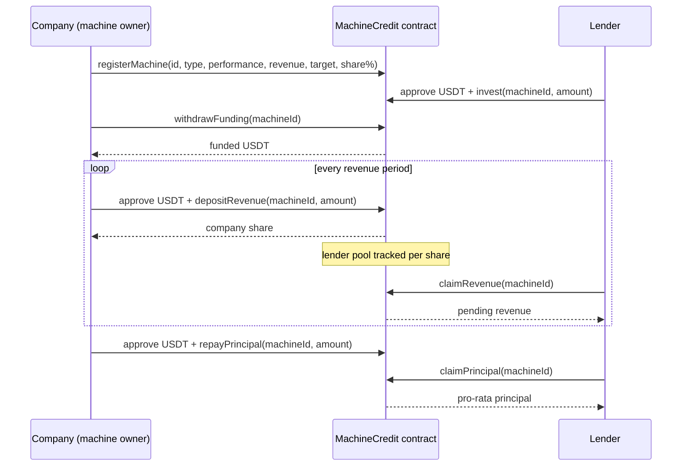

# MachineCredit

**Turn machine performance into capital.**

MachineCredit is an onchain revenue-based financing protocol for robots and industrial machines, built on **BOT Chain**. Machine operators raise USDT to finance a machine, and lenders are repaid automatically from the revenue that machine produces. Every step is settled by a smart contract: funding, the revenue split, and principal repayment.

| | |
|---|---|
| 🌐 **Live app** | https://www.machinecredit.my.id |
| 📜 **Smart contract (BOT Chain Mainnet)** | [`0x14f9b029Ab79307B8119163E8EFc51D68919E7c1`](https://scan.botchain.ai/address/0x14f9b029Ab79307B8119163E8EFc51D68919E7c1) |
| 💵 **Settlement token** | USDT on BOT Chain, [`0xaBabc7Ddc03e501d190C676BF3d92ef0e6e87a3C`](https://scan.botchain.ai/token/0xaBabc7Ddc03e501d190C676BF3d92ef0e6e87a3C) (6 decimals) |
| ⚙️ **Backend API** | https://incredible-victory-production-c40b.up.railway.app/api/machines |
| 🐦 **X / Twitter** | https://x.com/machinecredit |

<!-- Demo video: add link here -->

---

## The problem

Robots and autonomous machines (forklifts, AMRs, robotic arms) generate predictable, measurable revenue, but the companies that operate them struggle to finance new units:

- Banks look at the company balance sheet, not at how productive the machine is.
- Equipment financing is slow, opaque and closed to small capital providers.
- Investors have no transparent way to see how a financed asset is performing or to get paid directly from what it earns.

## The solution

MachineCredit treats **each machine as its own financeable asset**:

1. A company lists a machine with its performance, monthly revenue, funding target and revenue share.
2. Lenders fund the machine in USDT.
3. The company withdraws the capital to deploy the machine.
4. The machine's revenue is deposited to the contract, which **automatically splits** it between the company and the lenders, pro rata to each lender's stake.
5. At the end of the term, the company repays principal and lenders claim it back.

Every financing agreement, revenue payment and repayment is a transparent onchain event on BOT Chain.

---

## How it works



### Revenue split

When a company deposits revenue `R` for a machine:

```
lenderPool   = R × revenueShare% × (totalFunded / fundingTarget)
companyShare = R − lenderPool
```

- The lender pool scales with how much of the target was actually funded. A 50%-funded machine gives lenders half of the configured share.
- The lender pool is distributed with **per-share accounting** (`accumulatedRevenuePerShare`), so every lender earns in proportion to their stake. Capital that arrives later does not earn revenue that was deposited before it.
- The company share is paid out immediately. Lenders claim their share whenever they want.

### Financing lifecycle

| Status | Meaning |
|---|---|
| **Open** | Fundraising and machine operation. Lenders can invest, the company withdraws and deposits revenue. |
| **Completed** | The company repaid 100% of principal. Final. |
| **Defaulted** | The company repaid only part of the principal. The loss is recorded onchain. Final. |

Repayment is a **single, final settlement**. After it, the machine is closed for new investment and revenue, and lenders can still claim any remaining revenue and their share of the principal.

---

## Architecture

```
┌──────────────────────────┐        ┌──────────────────────────┐
│ Frontend (Vercel)        │        │ Backend API (Railway)    │
│ HTML / CSS / vanilla JS  │ ─────▶ │ Node.js + Express        │
│ ethers.js v6 + MetaMask  │  REST  │ ethers.js read-only      │
└──────────┬───────────────┘        └──────────┬───────────────┘
           │ sign transactions                 │ read state / event logs
           ▼                                   ▼
┌──────────────────────────────────────────────────────────────┐
│ BOT Chain Mainnet (chain id 677)                             │
│ MachineCredit.sol  ◀──▶  USDT (ERC-20, 6 decimals)           │
└──────────────────────────────────────────────────────────────┘
           ▲
           │ machine images
┌──────────┴───────────────┐
│ Supabase Storage         │
└──────────────────────────┘
```

| Layer | Tech | Responsibility |
|---|---|---|
| Smart contract | Solidity `^0.8.20` | Machine registry, investment, revenue split, withdrawal, repayment, principal claims, company whitelist |
| Frontend | HTML, CSS, vanilla JS, ethers.js v6 | Wallet connection, role-based UI (Company / Lender), sends all transactions from the user's wallet |
| Backend | Node.js, Express 5, ethers.js v6 | Aggregates machine and portfolio data from the contract, computes 30-day revenue from event logs (via Blockscout API) |
| Storage | Supabase Storage | Machine photos, stored per contract and onchain machine id |
| Hosting | Vercel (frontend), Railway (backend, Docker) | |

The backend is **read-only**: it never holds keys or signs transactions. Every state change is signed by the user in MetaMask.

---

## Smart contract

Source: [`backend/smartcontract-machinecredit/MachineCredit.sol`](backend/smartcontract-machinecredit/MachineCredit.sol)

| Function | Who | Description |
|---|---|---|
| `registerMachine(id, name, performance, monthlyRevenue, fundingTarget, revenueShare%)` | Approved company | Lists a new machine for financing |
| `invest(machineId, amount)` | Lender | Funds a machine with USDT (up to the funding target) |
| `withdrawFunding(machineId)` | Machine owner | Withdraws the funded principal |
| `depositRevenue(machineId, amount)` | Machine owner | Deposits revenue, splits it between company and lenders |
| `claimRevenue(machineId)` | Lender | Claims accumulated revenue |
| `repayPrincipal(machineId, amount)` | Machine owner | Final principal settlement (Completed or Defaulted) |
| `claimPrincipal(machineId)` | Lender | Claims pro-rata share of repaid principal |
| `setCompanyApproval(company, bool)` | Admin | Whitelists companies that may register machines |
| `transferAdmin(newAdmin)` | Admin | Transfers the admin role |

Views: `getMachine`, `getInvestor`, `getPendingRevenue`, `getFinancing`, `getPrincipalEntitlement`, `getClaimablePrincipal`, `getUSDTBalance`.

Safety measures:
- The USDT address is set in the constructor, so the same source deploys to testnet and mainnet.
- Token transfers go through a safe wrapper that supports ERC-20s with or without a `bool` return value.
- Withdraw, repay and principal claims are protected by a reentrancy guard.
- State is updated before external transfers (checks-effects-interactions).
- Only approved companies can register machines, so random wallets cannot list fake machines.

Deployment settings (for source verification): Solidity `0.8.34`, EVM version `cancun`, optimizer enabled with 200 runs, constructor argument `_usdt = 0xaBabc7Ddc03e501d190C676BF3d92ef0e6e87a3C`.

---

## Deployment

MachineCredit is deployed on both BOT Chain networks:

| Network | Chain ID | MachineCredit contract | USDT token |
|---|---|---|---|
| **BOT Chain Testnet** | 968 | [`0xe669BC1281F59ad94E36e850736E5B0075C16e39`](https://scan.bohr.life/address/0xe669BC1281F59ad94E36e850736E5B0075C16e39) | [`0x75edC9335175Fc0552D51D48439F229c10420fe3`](https://scan.bohr.life/address/0x75edC9335175Fc0552D51D48439F229c10420fe3) |
| **BOT Chain Mainnet** | 677 | [`0x14f9b029Ab79307B8119163E8EFc51D68919E7c1`](https://scan.botchain.ai/address/0x14f9b029Ab79307B8119163E8EFc51D68919E7c1) | [`0xaBabc7Ddc03e501d190C676BF3d92ef0e6e87a3C`](https://scan.botchain.ai/address/0xaBabc7Ddc03e501d190C676BF3d92ef0e6e87a3C) |

The live app at https://www.machinecredit.my.id uses the **mainnet** contract.

> **Note:** the testnet contract is an earlier version that we used to build and test the full financing flow. It has the same investment, revenue split, withdrawal, repayment and principal claim logic, but the USDT address is hardcoded instead of passed to a constructor, and it has no company whitelist. The mainnet contract matches the current [`MachineCredit.sol`](backend/smartcontract-machinecredit/MachineCredit.sol) in this repo.

---

## Testing guide for judges

### 1. Set up your wallet

1. Install [MetaMask](https://metamask.io).
2. Open https://www.machinecredit.my.id/app.html and click **Connect Wallet**. The app will ask MetaMask to add or switch to BOT Chain Mainnet. You can also add it manually:

   | Field | Value |
   |---|---|
   | Network name | BOT Chain Mainnet |
   | RPC URL | `https://rpc.botchain.ai` |
   | Chain ID | `677` |
   | Currency symbol | `BOT` |
   | Block explorer | `https://scan.botchain.ai` |

3. Make sure the wallet has a little **BOT for gas**, plus some **USDT** (a few dollars is enough) if you want to invest.
4. Choose a role when prompted: **I'm a Lender** or **I'm a Company**. The role is saved per wallet in the browser.

> ⚠️ This is a hackathon MVP running on mainnet with an **unaudited** contract. Please test with small amounts only.

### 2. Test as a Lender (no approval needed)

1. **Discover**: browse the machines listed for financing. Each card shows performance, monthly revenue and funding progress.
2. Open a machine and click **Invest in Machine →** with a small amount, e.g. `1` USDT. MetaMask asks for two signatures: USDT `approve`, then `invest`.
3. **Portfolio**: your position shows up with capital deployed, revenue received and status.
4. After the company deposits revenue, a **Claim $…** button appears under *Revenue Received*. Click it to receive your share.
5. After the company repays principal, a **Claim $…** button appears under *Principal*. Click it to get your capital back.

Every transaction links to the explorer in a toast, and appears in **Recent network activity** on the Discover page.

### 3. Test as a Company

Registering machines is limited to **whitelisted companies**, so that nobody can list fake machines on mainnet. To test the company flow with your own wallet, ask the team to approve it (admin calls `setCompanyApproval`). Otherwise the full company flow is shown in the demo video.

1. **Launch Robot**: upload a photo (PNG/JPG/WebP, max 5 MB), fill in machine ID, machine type, monthly revenue, performance, uptime, funding target and revenue share, then click **Register Machine →**.
2. Wait for lenders to invest.
3. **Deposit Revenue** page, then pick the machine:
   - **Withdraw Funding →**: receive the funded USDT.
   - **Deposit Revenue →**: send machine revenue. The contract pays your company share immediately and credits the lender pool.
   - **Repay Principal →**: final settlement. Repaying the full amount marks the financing **Completed**, a partial amount marks it **Defaulted**.

Wallets that are not whitelisted get the message *"This wallet is not an approved company yet"* when they try to register.

### 4. Verify onchain

- Contract and all its transactions: https://scan.botchain.ai/address/0x14f9b029Ab79307B8119163E8EFc51D68919E7c1
- Raw API data:
  - `GET /api/machines`: all machines with financing status
  - `GET /api/machines/monthly-revenue`: revenue deposited in the last 30 days (from `RevenueDeposited` events)
  - `GET /api/portfolio/:wallet`: a wallet's positions, earnings and claimable principal

---

## Running locally

### Backend

```bash
cd backend
cp .env.example .env    # mainnet values are listed (commented) in the file
npm install
npm start               # http://localhost:5000
```

Environment variables:

| Variable | Description |
|---|---|
| `RPC_URL` | BOT Chain RPC (`https://rpc.botchain.ai` for mainnet) |
| `BLOCKSCOUT_API_URL` | Explorer API (`https://scan.botchain.ai/api/v2` for mainnet) |
| `MACHINECREDIT_ADDRESS` | Deployed MachineCredit contract |
| `USDT_ADDRESS` | USDT token address |
| `PORT` | HTTP port (default `5000`) |

### Frontend

The frontend is static, so any static server works:

```bash
python -m http.server 5500
```

Then open http://localhost:5500. To point it at a local backend or at testnet, edit the top of [`js/app.js`](js/app.js):

- `API_BASE_URL`: backend URL
- `ACTIVE_NETWORK`: `"mainnet"` or `"testnet"`. Chain id, RPC, explorer and contract addresses are all defined in the `NETWORKS` object.

### Deploying the contract

1. Open [`MachineCredit.sol`](backend/smartcontract-machinecredit/MachineCredit.sol) in [Remix](https://remix.ethereum.org).
2. Compile with EVM version `cancun` (BOT Chain does not support Osaka opcodes) and the optimizer enabled.
3. Deploy with `_usdt` set to the USDT address of the target network. The deployer becomes admin and an approved company.
4. Put the new address into `NETWORKS.<network>.machineCreditAddress` in `js/app.js` and into `MACHINECREDIT_ADDRESS` for the backend.

---

## Repository structure

```
├── index.html                  Landing page
├── app.html                    dApp (Discover, Portfolio, Launch Robot, Deposit Revenue)
├── css/style.css
├── js/app.js                   Wallet, contract calls, UI rendering, network config
├── asset/                      Images and logos
└── backend/
    ├── Dockerfile
    ├── .env.example
    ├── smartcontract-machinecredit/
    │   └── MachineCredit.sol   Smart contract
    └── src/
        ├── server.js           Express app
        ├── config/blockchain.js
        ├── controllers/        machines, monthly revenue, portfolio
        └── routes/
```

---

## MVP assumptions and limitations

We kept the MVP deliberately simple. These are its known limits:

- **Trusted, whitelisted companies.** The contract does not force repayment. Lenders rely on the company being vetted by the admin before it can list machines.
- **Self-reported machine data.** Performance score and monthly revenue are entered by the company at registration. The performance chart on the machine page is **simulated** and labelled as such.
- **Revenue is deposited by the company**, not streamed directly from the machine.
- **No maturity date or refund path yet.** Funds can be withdrawn before the target is reached, and there is no automatic refund if fundraising fails.
- **Unaudited contract.** Use small amounts only.

## Roadmap

- **Machine telemetry oracle**: pull performance and revenue directly from machine IoT data and attest it onchain, replacing self-reported numbers.
- **Stronger lender protection**: fundraising deadline with automatic refunds, withdrawal only after the target is met, maturity dates and late-payment handling, company collateral or staking.
- **Automated revenue routing**: machine revenue flows straight into the contract without manual deposits.
- **Secondary market** for financing positions.
- **Security**: full test suite, external audit, pause/emergency controls, multisig admin.

---

## License

MIT
